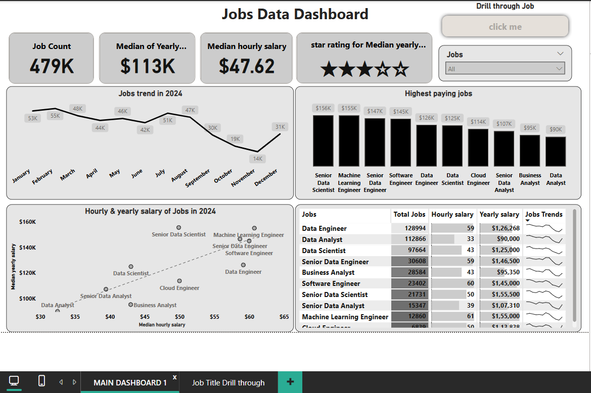
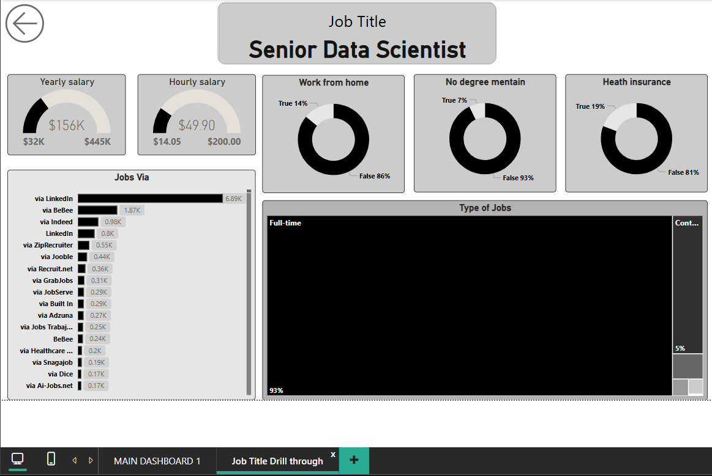
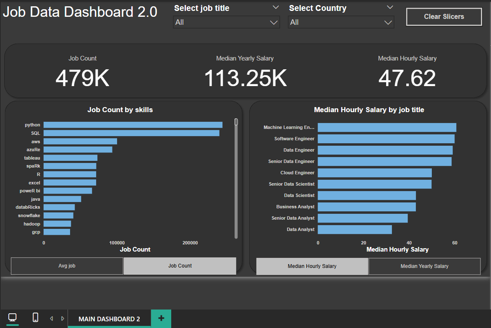

# Jobs Data Dashboard – Power BI Project

## Project Overview

This Power BI project analyzes a dataset containing job postings to uncover trends in job availability, salaries, skill demand, and role-specific insights for 2024. The dashboard provides a comprehensive view of job market dynamics across multiple titles and skill sets to help job seekers, analysts, and hiring teams make data-informed decisions.

## Features

---

### Dashboard 1: Main Jobs Data Dashboard
- **Total Job Count**: 479K jobs analyzed
- **Median Yearly Salary**: $113K
- **Median Hourly Salary**: $47.62
- **Job Trends by Month (2024)**: Shows fluctuation in job openings month over month
- **Top 10 Highest Paying Jobs**: Lists the most lucrative job roles by median yearly salary
- **Salary Comparison (Hourly & Yearly)**: Scatter plot comparing hourly and annual salaries by role
- **Detailed Job Table**: Lists job title, count, hourly salary, yearly salary, and job trend

---

---

### Drill-through Report: Job Role Deep Dive
- Focused report on **Senior Data Scientist**
- Details include:
  - Salary range (min to max)
  - Work from home availability
  - Degree requirements
  - Health insurance availability
  - Job source distribution (LinkedIn, Indeed, etc.)
  - Job types (Full-time, Contract, etc.)

---

---

### Dashboard 2: Advanced Jobs Dashboard
- Job Count by Technical Skills (e.g., Python, SQL, AWS, Tableau)
- Median Hourly Salary by Job Title
- Filters for Job Title and Country
- Clean dark-mode visual theme

## Tools & Technologies Used
- **Power BI Desktop**
- **Data Transformation**: Power Query Editor
- **DAX Measures**: For custom aggregations and salary calculations
- **Drill-through pages**: For job-specific detailed insights

## Key Insights
- **Most In-Demand Skills**: Python and SQL dominate job postings
- **Top Paying Roles**: Machine Learning Engineer and Software Engineer have the highest median hourly rates
- **Job Volume Leader**: Data Engineer has the highest number of postings
- **Remote Work**: Only a small percentage of high-paying roles offer remote flexibility
- **Education**: Most postings still require a formal degree

## Files Included
- `jobs dashboard.pbix` – Main Jobs Dashboard with interactive visuals
- `adv_jobs_dashboard.pbix` – Advanced dashboard focused on skills and salaries

## Contact
Tilak Laddha  
Email: tilakladdhaofficial2005@gmail.com  
